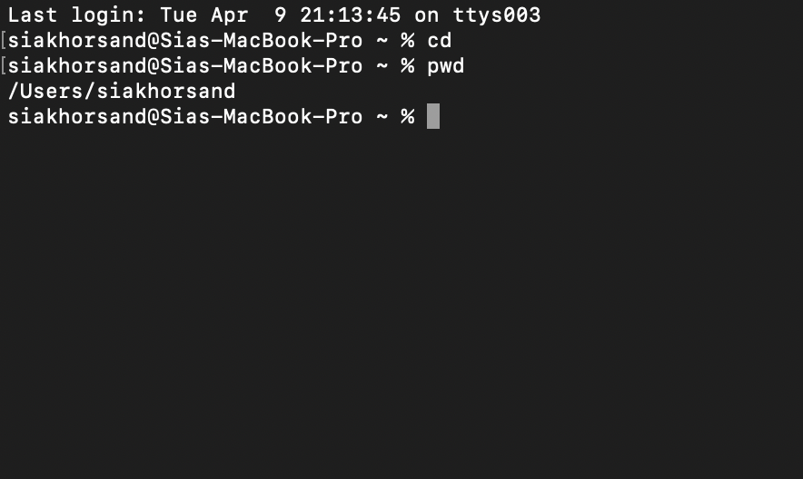
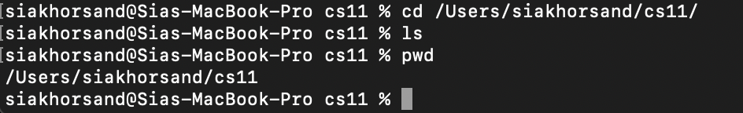

# Lab Report #1
- Here is an example of using *cd* with *no* arguments:
  
  `cd`

  This command simply takes the user to the home directory.

- Here is an example of using *cd* with a path to an example *directory*:

`cd/Users/siakhorsand/cs11`

This command takes the terminal to the cs11 folder. 

