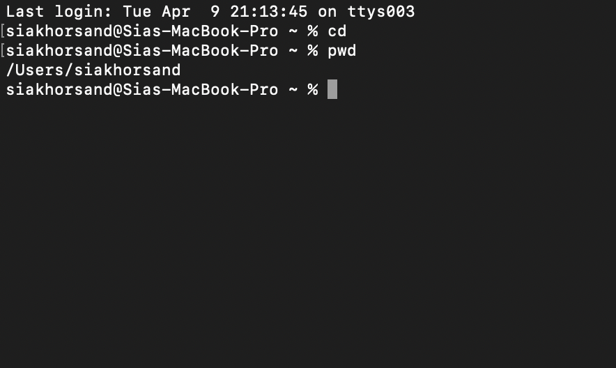
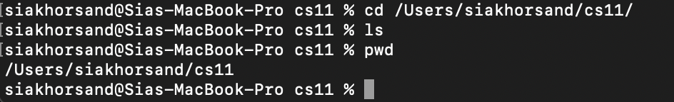
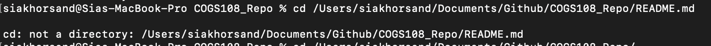
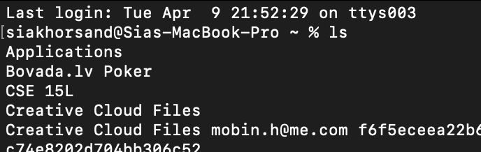
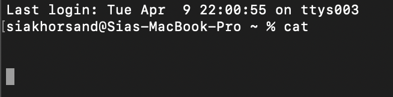
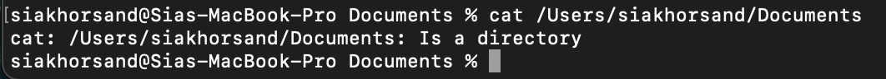
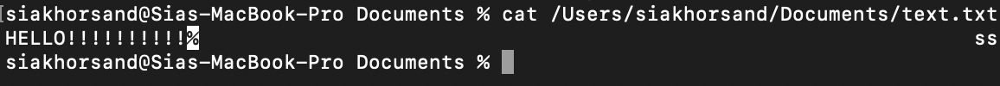

# Lab Report #1

## *cd* - change directory 

- Here is an example of using *cd* with *no* arguments:
  
`cd`
  Before running this command, the working directory path is 
  `/Users/siakhorsand`
  
  This command simply takes the user to the home directory.

- Here is an example of using *cd* with a path to an example *directory*:

`cd cs11`

Before the above command is run, the absolute path is: 
  `/Users/siakhorsand`

This command takes the terminal to the cs11 folder (*ls* and *pwd* are then used to check the contents of the folder/current directory).

- Here is an example of using *cd* with a direct path to a file:

`cd /Documents/Github/COGS108_Repo/README.md`

Before the above command is run, the absolute file path is 
  `/Users/siakhorsand/`

As you can see in the image below, *cd* does *not* work and causes an error. That is because *cd* solely changes directories/folders and does not open files or show their contents. 

## *ls* - list

- Here is an example of using *ls* with *no* arguments:

`ls`

Before the above command is run, the absolute file path is 
  `/Users/siakhorsand/`

This command simply shows the contents of the current directory.

- Here is an example of using *ls* with a path to a directory:

`ls /Users/siakhorsand/Documents/`

Before the above command is run, the absolute file path is 
  `/Users/siakhorsand/`

This argument simply shows the contents of the directory to which the terminal has traveled. 

- Here is an example of using *ls* with a path to a file in a directory:

`ls text.txt`

Before the above command is run, the absolute file path is 
  `/Users/siakhorsand/Documents/`

This argument takes the terminal to the path of the file, if the file exists. 

## *cat* - concatenate and display 

- Here is an example of using *cat* with *no* arguments:

`cat`

As shown in the image below, *cat* with no arguments has no output, because it waits for more input.

Before the above command is run, the absolute file path is 
  `/Users/siakhorsand/`

- Here is an example of using *cat* with a path to a directory:

`cat /Users/siakhorsand/Documents`

Before the above command is run, the absolute file path is 
  `/Users/siakhorsand/`
  
The Documents folder is a directory and not a file. Therefore, cat does not perform its function and produces this error message. 

- Here is an example of using *cat* with a path to a file:
  
`cat text.txt`

Before the above command is run, the absolute file path is 
  `/Users/siakhorsand/Documents`

This argument shows the contents of the specific text file in the directory that is specified. 

