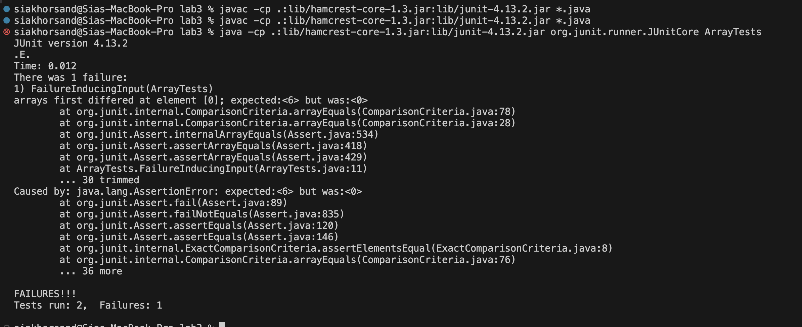

# Lab 3: Debugging and Command-Line Tools
Sia Khorsand 


## Part 1: Debugging
For the purposes of this lab report, we will be using ArrayExamples.java as an example. 


### Failure-Inducing Input

**JUnit Test Case:**

```java
import static org.junit.Assert.*;
import org.junit.Test;

public class ArrayTests {
    @Test
    public void FailureInducingInput() {
        int[] newArr = {6,12,14,5,9,2};
        int[] input = {2,9,5,14,12,6};
        int[] expectedOutput = newArr;
        assertArrayEquals(expectedOutput, ArrayExamples.reversed(input));
    }
}

```
This test case provides an input array to the *reversed* method and expects the output to be the reversed version of the input. This input should induce a failure in the buggy program.
This test case actually should be successful but is not due to the fact that  ArrayExamples is buggy.
We will fix this bug in the following steps.

### Non-Failure-Inducing Input

**JUnit Test Case:**

```java
import static org.junit.Assert.*;
import org.junit.Test;

public class ArrayTests {
    @Test
    public void testNonFailureInducingInput() {
        int[] input = {3, 7, 8};
        int[] expectedOutput = {8, 7, 3};
        ArrayExamples.reversed(input);
        assertArrayEquals(input, input);
    }
}
```
This test case provides an input array to the *reversed* method and expects the output to be the reversed version of the input. This input should induce a success in the buggy program.
This test case actually should fail but is not failing due to the fact that ArrayExamples is buggy.
We will fix this bug in the following steps.


### Symptom and the output of running above tests



Here is the output from running the tests above. As expected, one of them **fails** and the other **passes**.


### Before and After 

```java

public class ArrayExamples {    
  static void reverseInPlace(int[] arr) {
    for(int i = 0; i < arr.length; i += 1) { 
      arr[i] = arr[arr.length - i - 1];
    }
  }

  static int[] reversed(int[] arr) {
    int[] newArray = new int[arr.length];
    for(int i = 0; i < arr.length; i += 1) { 
      arr[i] = newArray[arr.length - i - 1]; //assigns to current array 
    }
    return arr; //returns current array
  }

```
The problem is that the *reverseInPlae* method incorrectly indexed the input in the for loop and assigned values to the **original** array rather than a **newly assigned** array. 

So, to fix this, i added a new array and fixed the indexing issues in the for loop of 

```java
  static void reverseInPlace(int[] arr) { 
    for(int i = 0; i < arr.length/2; i ++) { //correct reversing logic 
      int temp = arr[i];
      arr[i]= arr[arr.length - i - 1];
      arr[arr.length - i - 1] = temp; // temporary value 
    }
  }

  static int[] reversed(int[] arr) {
    int[] newArray = new int[arr.length];
    for(int i = 0; i < arr.length; i++) {
      newArray[i] = arr[arr.length - i - 1]; // currect indexing assigned to new array 
    }
    return newArray; // returns the new array 
  }

```
The bug was a logical problem caused by incorrect indexing in the *reverseInPlace* method that resulted in incorrect value assignments. The reversing logic implemented in the first method **overwrites** the beginning of the array with the end elements before they can are swapped, producing the **incorrect** result. The second method uses the same incorrect logic but assigns the values to a new array, which is not returned. The fixed implementations of these methods **correctly** swaps elements using the right algorithm to reverse the arrays. And the fixed second method **correctly** assigns to the new array and returns the new array. 


