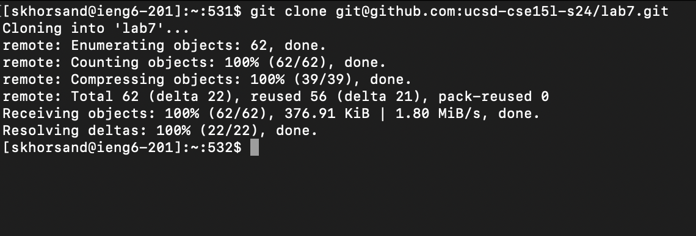
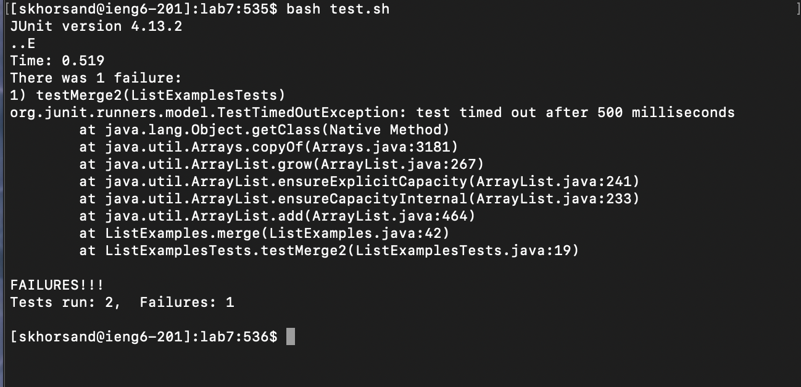
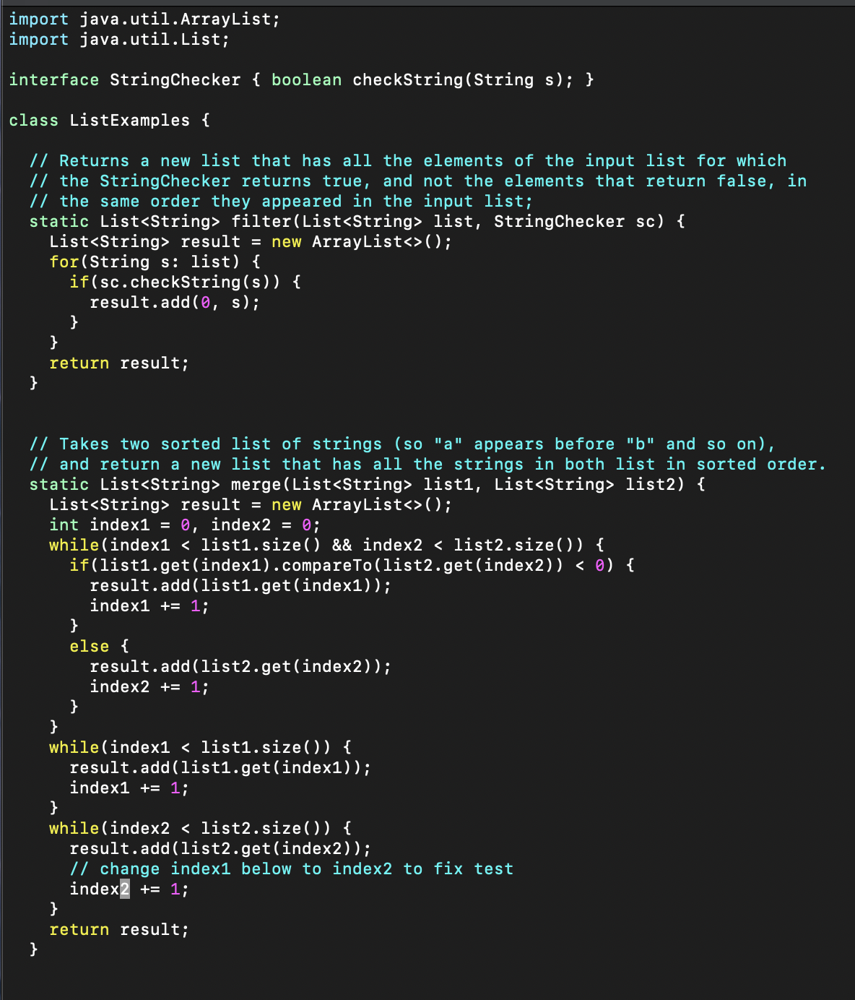
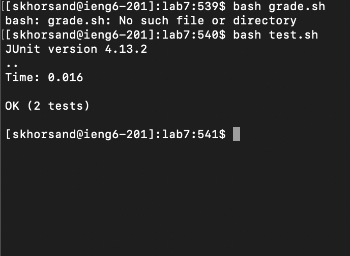
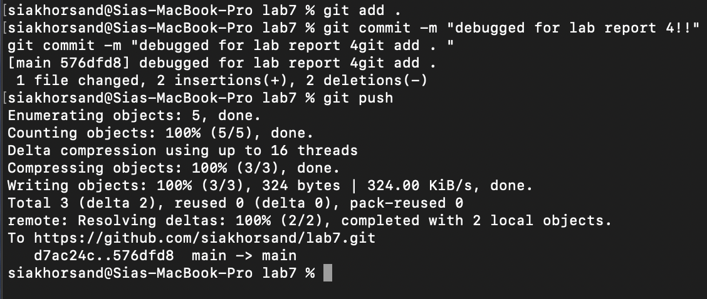

# Lab Report 4: Vim

**by Sia Khorsand**

In this lab report, I will go through the steps of lab7 and demonstrate what keys were pressed for each step of the way and what they accomplished.


## Section 1


### Keys Pressed:

- ```ssh skhorsand@ieng6.ucsd.edu <enter>```

### Accomplished:

- Successfully ssh'd into my ieng6 account. 

## Section 2



### Keys Pressed:

- ```
  git clone git@github.com:ucsd-cse151-s24/lab7.git <enter>
  ``` 

### Accomplished:

- Cloned my fork of the repository from the github `ssh` link

## Section 3



### Keys Pressed:

 ```
  cd lab7
  bash test.sh
 ```
### Accomplished:

- Changed directory to lab7, ran the tests in the repository, and demonstrated that they fail.

  
## Section 4



### Keys Pressed:

```
  vim ListExamples.java
  /index1
  n
  n
  n
  n
  cw
  "index2 " 
  <esc>
  n
  n
  n
  n
  n
  cw
  "index2"
  <esc>
  ":wq"
```
### Accomplished:

- Edited the code to fix the bugs. Using `/` to search for "index1" and `cw` to remove the word to be able to replace with "index2". And finally, saving the changes using `":wq"`

## Section 5



### Keys Pressed:

- `bash test.sh`

### Accomplished:

- Ran the tests and demonstrated that the tests pass. 

## Section 6



### Keys Pressed:

- ```
  git add .
  git commit - "debugged for lab report 4!!
  git push
  ```

  

### Accomplished:

- Commited and pushed the changes to my fork. 
