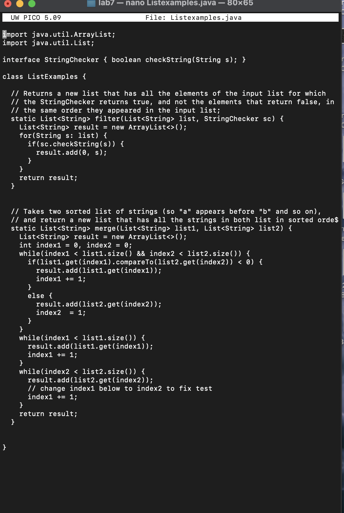
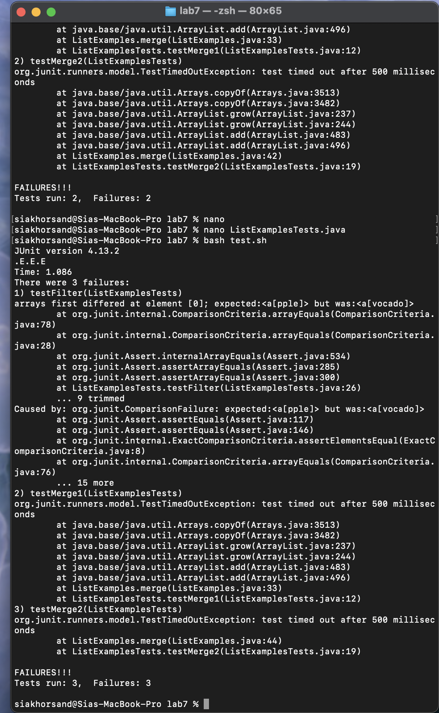
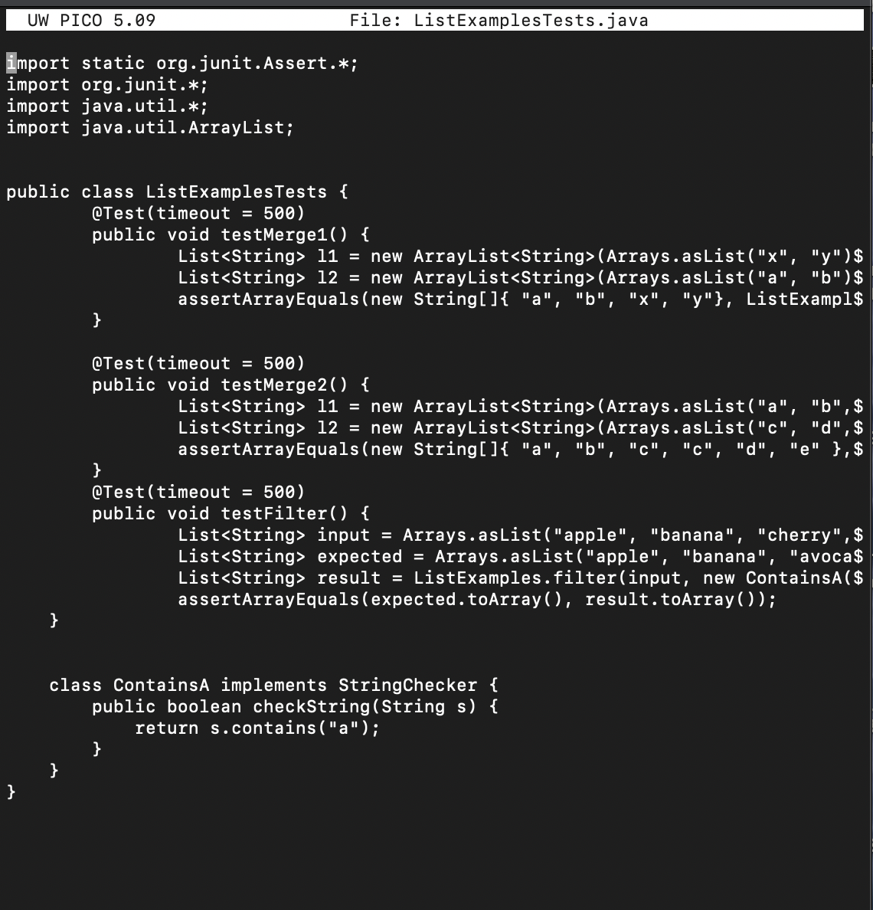
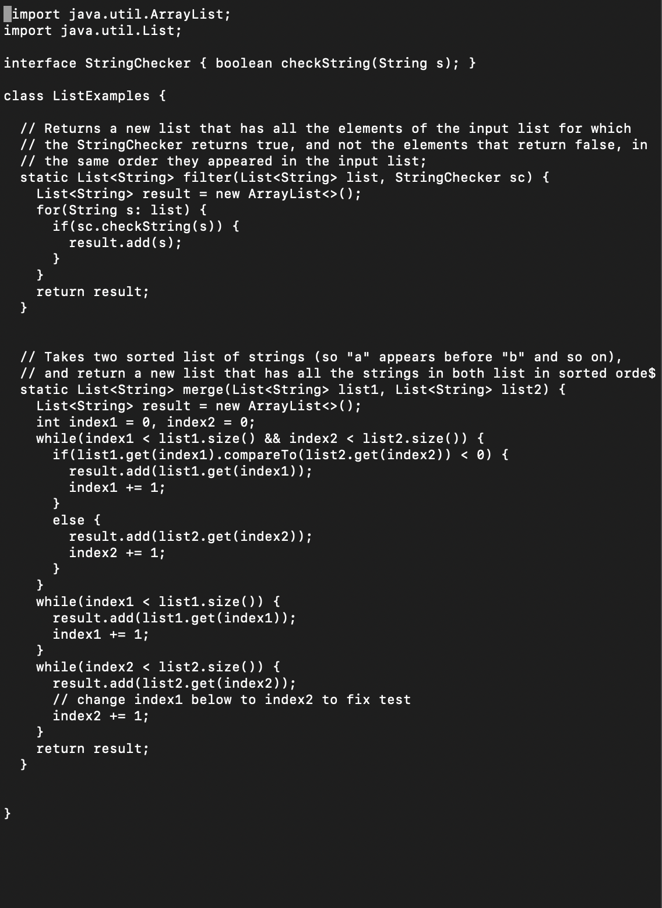

# Lab Report 5: Putting it All Together

**by Sia Khorsand**

## Part 1 – Debugging Scenario

### Original Post

**Student Post:**

message: 
> I'm currently writing some tests for ListExamples. I'm using JUnit to write the tests, but I'm running into some issues.
> Here are my symptoms:
The testFilter method is failing with a runime error. The expected array is [apple, banana, avocado], but the actual result is [avocado].
The testMerge1 and testMerge2 methods are both timing out after 500 milliseconds. I'm guessing I did something wrong with the indexing of the filter method but I might be wrong.

>For the testMerge1 and testMerge2 failures, I guess there might be an issue with the merging logic causing an infinite loop which could lead to the runtime error.
>Please let me know what I can do to fix these issues!

>Best,

>Sia Khorsand 

Here is a screenshot of my code:



Here is a screenshot of the output: 



Here is a screenshot of the tests: 


Bash script: 
```
#!/bin/bash

javac -cp .:junit-4.13.2.jar:hamcrest-core-1.3.jar ListExamples.java ListExamplesTests.java
java -cp .:junit-4.13.2.jar:hamcrest-core-1.3.jar org.junit.runner.JUnitCore ListExamplesTests > test_output.txt

if grep -q "FAILURES!!!" test_output.txt;
then
    echo "Some tests failed. Check test_output.txt for details."
else
    echo "All tests passed!"
fi
```
### TA Response

**TA Response:**
message: 
> Hi Sia,
> Let's start by looking at the filter method. You could maybe check what is assigned to `result` and trace your logic problem from there. You might want to look at the number before the comma, and whether it is necessary.
> For the merge method, you are right that the loops are running indefinitely. Maybe re-check the reassignments of index1 and index2 in your if/else statements and the conditions of the while loops.
> Let me know once you try.

> Best,

> Your TA

### Student Follow-Up

**Student Follow-Up:**


message: 
> Thanks for the pointers!
> I went back and reviewed the ContainsA implementation and realized that the checkString method was fine.
> But the issue was in how I was adding elements to the result list in the filter method.
> I was adding elements at the beginning (result.add(0, s)) instead of the end. I changed it to result.add(s), and that fixed the testFilter issue.

> For the testMerge1 and testMerge2 methods, you were right about the while loop.
>  I had an incorrect index update within the else block.
> I fixed the index update to ensure it increments correctly, and now the tests run within the time limit.


message: 

**Setup Information:**
- **File & Directory Structure:**
